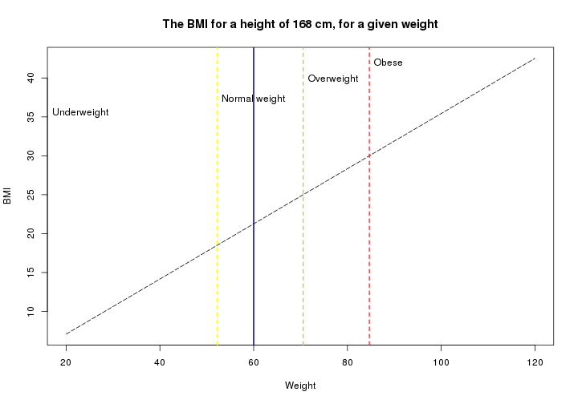

## About

To show what we learned in this coursera course, this Shiny app was created. 
It calculates the BMI, based on the input:
- Height (cm)
- Weight (kg)

---

## Calculations

The simplest part is the calculation of the BMI itself.


```r
#The function to calculate the BMI
calcbmi <- function(height, weight) round(weight/(height/100)^2, 2)

#Example
height <- 168
weight <- 60
calcbmi(height, weight)
```

```
## [1] 21.26
```

---

## Calculations

Furthermore, to determine whether the person is of normal weight or not, the limits 
for the given height are calculated.


```r
#Calculation
calclimits <- function(height) {
  i <- numeric(3)
  i[1] <- 18.5 * (height/100)^2 #<18.5 = underweight
  i[2] <- 25 * (height/100)^2   #18.5 - 25 = normal weight
  i[3] <- 30 * (height/100)^2   #25 - 30 = overweight | >30 = obese
  i
}

#Example
calclimits(168)
```

```
## [1] 52.2144 70.5600 84.6720
```

---

## Plot

A plot is created to show how close you are to a healthy/unhealthy weight. Code is 
not shown in the slidify presentation, but can be found in the Rmd and of course in 
the Shiny server files.


